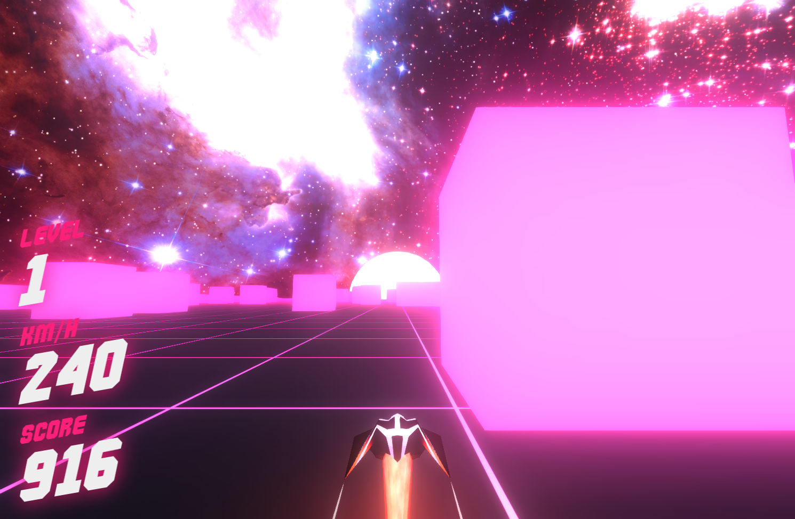
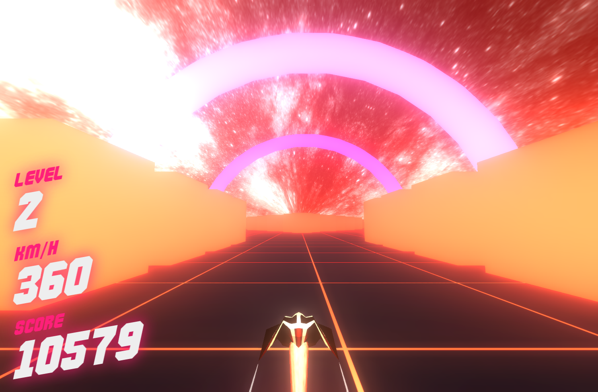

# Rocket Rush

A browser-based 3D hyper-casual arcade tunnel runner built with React, Three.js, React Three Fiber, and a real-time bun WebSocket backend.

Dodge obstacles at increasing speeds through a neon synthwave tunnel. Set personal bests, race your ghost, and climb the global leaderboard.

<p align="center">
  
  
</p>

---

## Tech Stack

| Layer | Technology |
|---|---|
| **Framework** | React 18 |
| **3D Engine** | Three.js via React Three Fiber (`@react-three/fiber`) |
| **3D Helpers** | Drei (`@react-three/drei`) |
| **State** | Zustand (`zustand`) |
| **Auth** | Dynamic Labs SDK (`@dynamic-labs/sdk-react-core`) + Solana connectors |
| **Networking** | Custom Protobuf over WebSocket (binary) |
| **Styling** | CSS modules |
| **Music** | Built-in synthwave track with beat-synced visual effects |

---

## Project Structure

```
rocket-rush/
├── public/
│   ├── fonts/                  # Commando and Road Rage typefaces
│   ├── draco/                  # Draco mesh decoder (WASM)
│   ├── *.png                   # Logo, favicon, screenshots
│   └── *.mp3                   # Game music
└── src/
    ├── index.js                # App entry — DynamicContextProvider + root render
    ├── components/
    │   ├── CubeWorld.js        # Root scene composer (Canvas + all children)
    │   ├── Ship.js             # Player ship model, physics, exhaust FX
    │   ├── GhostShip.js        # Personal-best ghost replay (autonomous)
    │   ├── GameState.js        # Game loop, score, tick telemetry, start/over
    │   ├── KeyboardControls.js # Keyboard input binding
    │   ├── Ground.js           # Infinite scrolling ground planes
    │   ├── Walls.js            # Tunnel boundary walls + collision
    │   ├── Cubes.js            # Dynamic obstacle cubes
    │   ├── FixedCubes.js       # Static obstacle placements
    │   ├── CubeTunnel.js       # Tunnel mesh segments
    │   ├── Skybox.js           # Background sky and sun
    │   ├── Hyperspace.js       # Speed-warp hyperspace tunnel effect
    │   ├── Effects.js          # Post-processing effects
    │   ├── Sound.js            # Audio player with beat-sync
    │   ├── GlobalColor.js      # Color palette cycler
    │   ├── Arch.js             # Level-transition arches
    │   └── html/               # DOM overlay components (HUD, menus)
    │       ├── Overlay.js      # Main menu, wallet, username editor
    │       ├── Hud.js          # In-game heads-up display
    │       ├── GameOverScreen.js # Death screen with leaderboard
    │       ├── AnimatedLeaderboard.js # Real-time climbing leaderboard
    │       ├── CustomLoader.js # Asset loading progress bar
    │       ├── Author.js       # Footer attribution
    │       └── SynxedMiniPlayer.js # External audio player widget
    ├── services/
    │   └── leaderboardService.js # WebSocket client, protobuf, session management
    ├── proto/
    │   └── protoCodec.js       # Binary protobuf encoder/decoder + ghost blob codec
    ├── state/
    │   └── useStore.js         # Global Zustand store (game state, identity, leaderboard)
    ├── constants/
    │   └── index.js            # Game constants (speed, bounds, colors, sizes)
    ├── util/
    │   ├── distance2D.js       # 2D distance function
    │   ├── randomInRange.js    # Random number generator
    │   └── generateFixedCubes.js # Obstacle layout generator
    └── styles/
        ├── index.css           # Global styles
        ├── normalize.css       # CSS reset
        ├── gameMenu.css        # Overlay, leaderboard, username UI
        └── hud.css             # HUD layout
```

---

## Architecture

### Game Loop (`GameState.js`)

```
useFrame (every frame, ~60fps)
├── Acceleration: gameSpeed → desiredSpeed (smooth ramp)
├── Forward movement: ship.position.z -= speed × delta × 165
├── Lateral steering: ship.position.x += horizontalVelocity × delta × 165
├── Score: Math.abs(ship.position.z) - 10
├── Tick telemetry (every 250ms):
│   └── WebSocket → GAME_TICK { score, speed, level, x, y, z }
└── Game over detection → submitScore
```

### State Management (`useStore.js`)

```
Zustand Store
├── Game state:   score, level, gameOver, gameStarted, gameSession
├── Controls:     left, right, steeringSensitivity, musicMuted
├── Identity:     walletAddress, uid, username
├── Leaderboard:  leaderboard[], currentWeek, userRank, userHighScore
├── Ghost:        ghostPath[], ghostInterval
├── Session:      sessionId
└── Refs:         ship, camera, directionalLight, sun
```

### Networking (`leaderboardService.js`)

Binary Protobuf over WebSocket with auto-reconnect:

```
WebSocket Lifecycle
├── connect()          → WS upgrade, subscribe to leaderboard topic
├── onopen             → GET_LEADERBOARD + re-establish active session
├── onmessage          → decode binary → update Zustand store
├── onclose            → reconnect after 3s delay
└── onerror            → log, wait for onclose

Message Flow
├── startSession()     → START_SESSION → SESSION_STARTED { sessionId, uid, ghostPath }
├── sendTick()         → GAME_TICK { score, speed, level, x, y, z } (every 250ms)
├── submitScore()      → SUBMIT_SCORE → SCORE_SUBMITTED { rank, score, valid }
├── getLeaderboard()   → GET_LEADERBOARD → LEADERBOARD { week, entries[] }
├── updateUsername()   → UPDATE_USERNAME → USERNAME_UPDATED { success }
├── checkUsername()    → CHECK_USERNAME → USERNAME_CHECKED { available }
└── mergeGuestScores() → MERGE_GUEST → merges rush_* scores into wallet identity
```

---

## Features

### Ghost Ship — Personal Best Replay

When you start a new run, a translucent grey "ghost" ship follows your personal best path. The ghost replays autonomously on a timer, completely decoupled from your current ship. It continues flying after you die until you click START again.

- **Recording**: Ship position (x, y, z) captured every 250ms during gameplay
- **Storage**: Binary blob at 10 bytes per coordinate point (z: float32, x: int16 quantized, y: float32)
- **Playback**: O(1) frame cost via `index = elapsed / interval` with linear interpolation
- **Mesh**: Simplified capsule + wings (~50 triangles) with translucent grey material
- **12 KB per user** for a 5-minute personal best. **12 GB total for 1M users**.

### Real-Time Global Leaderboard

- Weekly rotating leaderboard with Redis Sorted Sets
- Live top-20 broadcast to all connected players via WebSocket pub/sub
- Climbing animations when ranks improve
- Personal rank tracker — see your global position

### Anti-Cheat Telemetry

Server-side validation of every game session:
- **Monotonic score** — score cannot decrease
- **Speed ceiling** — speed bounded by `base + level × perLevel + grace`
- **Acceleration cap** — speed cannot increase faster than `SPEED_ACCEL_MAX`
- **Level consistency** — level must match `floor(score / SCORE_UNITS_PER_LEVEL)`
- **Clock validation** — timestamps within ±30s of server time
- **Score plausibility** — score increase bounded by `maxSpeed × scorePerUnitSpeed × time`

### User Identity System

| State | Identity | Behavior |
|---|---|---|
| **Guest** | `rush_<random>` (localStorage) | Plays anonymously, scores tracked by rush_id |
| **Wallet** | Solana wallet via Dynamic | Scores linked to wallet address |
| **Email OTP** | Embedded wallet via Dynamic | Scores linked to embedded wallet |
| **Merge** | Guest → Wallet | All guest scores and username transferred on sign-in |

### Custom Usernames

- Globally unique callsigns (3-16 characters, alphanumeric + `_` `-`)
- Real-time availability checking with debounced validation
- Profanity filter
- Atomic swap via server-side Lua script — no double-claim race conditions

---

## Getting Started

### Prerequisites

- **Node.js** >= 18, < 23
- **npm** >= 9
- A running [rocket-rush-backend](https://github.com/clementcyberknight/rocket-rush-backend) server
- A [Dynamic Labs](https://dynamic.xyz) environment ID (for wallet auth)

### 1. Install

```bash
git clone https://github.com/clementcyberknight/rocket-rush.git
cd rocket-rush
npm install
```

### 2. Configure Environment

```bash
cp .env.example .env
```

Edit `.env`:

```env
REACT_APP_DYNAMIC_ENVIRONMENT_ID=your_dynamic_environment_id
REACT_APP_WS_URL=ws://localhost:3000
```

| Variable | Required | Default | Description |
|---|---|---|---|
| `REACT_APP_DYNAMIC_ENVIRONMENT_ID` | Yes | — | Dynamic Labs environment ID for wallet auth |
| `REACT_APP_WS_URL` | No | `ws://localhost:3000` | Backend WebSocket URL |

### 3. Run

```bash
npm start
```

Opens on `http://localhost:3000`.

### 4. Build for Production

```bash
npm run build
```

Output in `build/`. Serve with nginx or any static file server.

### Docker (Production)

A `Dockerfile` and `nginx.conf` are included for containerized deployment:

```bash
docker build -t rocket-rush .
docker run -p 80:80 rocket-rush
```

---

## Controls

| Action | Keyboard | Mobile |
|---|---|---|
| Steer Left | `A` / `←` | On-screen left button |
| Steer Right | `D` / `→` | On-screen right button |
| Sensitivity | 0.7x – 2.0x (menu slider) | Same |

---

## WebSocket Protocol

The game communicates with the backend using a custom binary Protobuf protocol over WebSockets. All messages are encoded as varint-length-delimited binary packets.

### Client → Server

| Type | Name | Fields |
|---|---|---|
| 1 | `START_SESSION` | `wallet`, `username?` |
| 2 | `GAME_TICK` | `sessionId`, `score`, `speed`, `level`, `timestamp`, `x`, `y`, `z` |
| 3 | `SUBMIT_SCORE` | `sessionId`, `wallet`, `score`, `username?` |
| 4 | `GET_LEADERBOARD` | `limit?`, `week?` |
| 5 | `UPDATE_USERNAME` | `wallet`, `username` |
| 6 | `MERGE_GUEST` | `fromWallet`, `toWallet` |
| 7 | `CHECK_USERNAME` | `username`, `wallet` |

### Server → Client

| Type | Name | Fields |
|---|---|---|
| 1 | `SESSION_STARTED` | `sessionId`, `uid`, `ghost?` |
| 2 | `LEADERBOARD` | `week`, `entries[]` |
| 3 | `SCORE_SUBMITTED` | `score`, `rank`, `valid` |
| 4 | `ERROR` | `message` |
| 5 | `USERNAME_UPDATED` | `success`, `message`, `username?` |
| 6 | `USERNAME_CHECKED` | `available`, `error?` |

### Ghost Blob Encoding

The `ghost` field in `SESSION_STARTED` is a compact binary blob:

```
Header (4 bytes):
  [interval_ms: uint16 BE] [point_count: uint16 BE]

Each point (10 bytes):
  [z: float32 LE] [x: int16 LE] [y: float32 LE]

x_real = x_encoded / 109.2266  (covers -300 to 300 range with 0.009 precision)
y_real = y_encoded as float32  (full precision)
```

---

## Scripts

| Command | Description |
|---|---|
| `npm start` | Start dev server on `0.0.0.0:3000` |
| `npm run build` | Production build to `build/` |
| `npm test` | Run Jest test suite |
| `npm run eject` | Eject from react-scripts |

---

## Performance Notes

- **Draco compression**: 3D assets use Google Draco for compressed loading
- **Tick rate**: 250ms intervals (4 ticks/sec) — balanced for anti-cheat fidelity and network load
- **Ghost ship**: Simplified mesh (50 tris vs 500 for full ship), O(1) playback
- **DOM overlays**: HUD and menus use CSS `position: fixed` with pointer-events separation from the WebGL canvas
- **Mobile**: Touch controls auto-enabled on mobile devices. `dpr` capped at `[1, 1.5]` for battery efficiency.

---

## License

MIT
